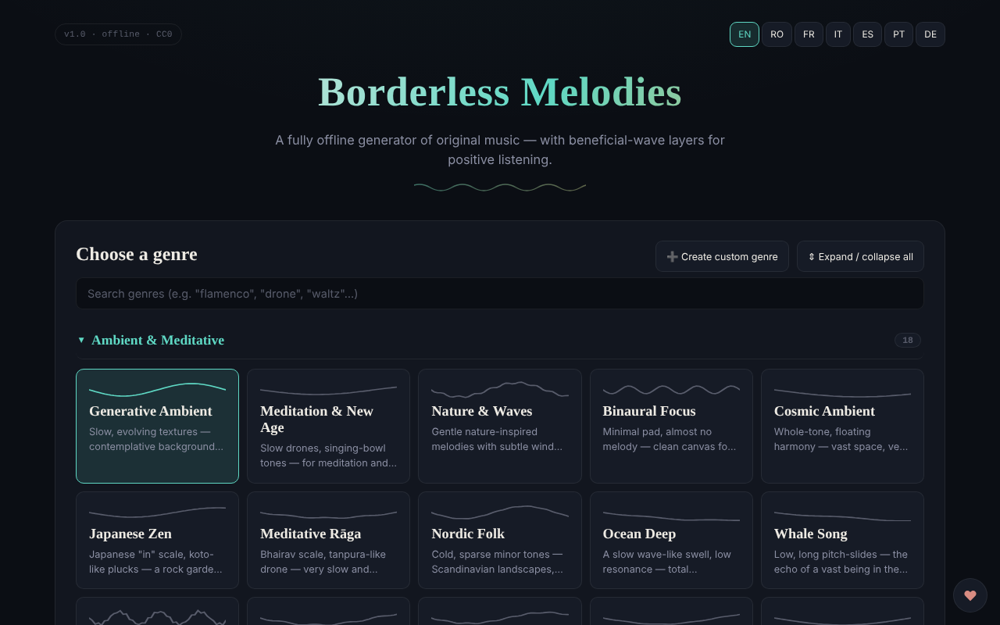

# Borderless Melodies

Generator de muzică originală, creată algoritmic în browser, cu straturi opționale de unde „benefice".

**Live:** https://chiuta.github.io/BorderlessMelodies/

## Ce este

Borderless Melodies („Melodii fără frontiere") este un fișier HTML unic care sintetizează muzică în timp real prin Web Audio: fără mostre sau înregistrări, doar sinteză procedurală. Alegi un gen, un seed și o durată, iar aplicația compune melodia, acompaniamentul și basul, pe care le poți asculta sau exporta.

## Funcții

- Alegere de gen dintr-o listă și editor de genuri proprii („Create custom genre": scară, progresie, metrică 4/4, 3/4, 5/4, 7/4, tempo, melodie lead, pad/acorduri, bas, textură, filtru, reverb, opțiuni avansate); genurile se salvează în „My Genres" și se pot exporta/importa (JSON).
- Compoziție: Seed (cu „Randomize"), Tempo, „Variety & arc", Duration (2, 5, 10, 20 min sau buclă continuă), „Regenerate".
- „Beneficial waves": strat auxiliar în modurile Pure tone, Binaural sau Isochronic, cu frecvență purtătoare, frecvență de bătaie și mixaj. Aplicația precizează că sunt oferite doar pentru relaxare, nu ca tratament medical, și conține avertismente (epilepsie, sarcină, condus).
- „Human voice": strat vocal fără cuvinte, sintetizat prin formanți, cu mai multe caractere (copil, adolescent, adult, senior, robotic melodios).
- „Gong & conch": gong și scoică sintetizate, apelabile manual sau automat la început/sfârșit.
- Redare cu Play/Stop, volum și vizualizator fractal pe ecran complet (2D/3D).
- Export audio WAV sau FLAC (1-20 min), export/import setări (JSON), copertă generativă (PNG/WebP/JPEG) legată de seed, export video WebM al vizualizatorului.
- Interfață în 7 limbi: EN, RO, FR, IT, ES, PT, DE.

## Manual de utilizare

1. Alege limba din butoanele EN / RO / FR / IT / ES / PT / DE.
2. Alege un gen (sau „Create custom genre", configurezi și apeși „Save").
3. Setează Seed (sau 🎲 Randomize), Tempo și Duration.
4. Opțional: activează „Beneficial waves", „Human voice" sau gongul/scoica.
5. Apasă ▶ Play; Space pornește/oprește redarea (când focusul nu e pe un câmp sau buton).
6. În vizualizatorul fractal: `+` / `=` apropie, `-` / `_` depărtează, `0` resetează, Esc închide.
7. La „Export" alege durata și formatul (WAV sau FLAC) și apasă „Export audio".
8. Pentru a păstra configurația: „Export settings (JSON)" și, ulterior, „Import settings"; la fel „Export my genres" / „Import genres".
9. „Generate cover" creează coperta, apoi „Export PNG" (sau WebP/JPEG). „Record video" înregistrează în timp real (un clip de 20 min durează 20 min).

## Confidențialitate și rețea

- Aplicația nu folosește `localStorage`, `sessionStorage` sau IndexedDB: nimic nu este reținut între sesiuni; salvezi doar prin fișierele exportate.
- Nu efectuează cereri de rețea (nu are `fetch`, CDN-uri sau scripturi externe). Conține doar link-uri, deschise la click, către trom.tf, Patreon și Buy Me a Coffee.

## Avertisment

Conținut informativ/experiențial. Stratul „Beneficial waves" (tonuri pure, binaurale, izocronice) este oferit doar pentru relaxare, nu este tratament medical și nu înlocuiește sfatul medical; dovezile științifice privind efectele ritmurilor binaurale/izocronice sunt limitate. Nu este recomandat în caz de epilepsie, altă afecțiune neurologică sau sarcină fără acordul medicului; nu asculta în timpul condusului; oprește dacă simți disconfort; folosește volum redus. Avertismentul apare în aplicație (panoul „Beneficial waves") și în subsolul paginii.

## Rulare locală / offline

Descarcă `index.html` și deschide-l în browser; funcționează complet fără internet.

## Licență

CC0 1.0 Universal (domeniu public) — vezi fișierul LICENSE

## Audit

2026-10-10: verificat că în cod nu există `fetch`, XHR, WebSocket sau resurse externe (0 cereri de rețea în browser) și că nu se folosește stocare locală. Pagina nu are politică CSP (meta). Corectate: nume accesibile pentru comutatoare/selectoare, contrast, notă de avertisment în subsol.

## Autor

Alexio — Alexandru-Ionuț Chiuță, contact: alexio@trom.tf

## English summary

Borderless Melodies is a single-file HTML generator of original music synthesised procedurally in the browser (Web Audio), with custom genres, optional binaural/isochronic layers, a wordless synthesised voice, gong and conch, a fractal visualizer, and export to WAV/FLAC, cover art and WebM video. 7 UI languages. It stores nothing and makes no network requests.
